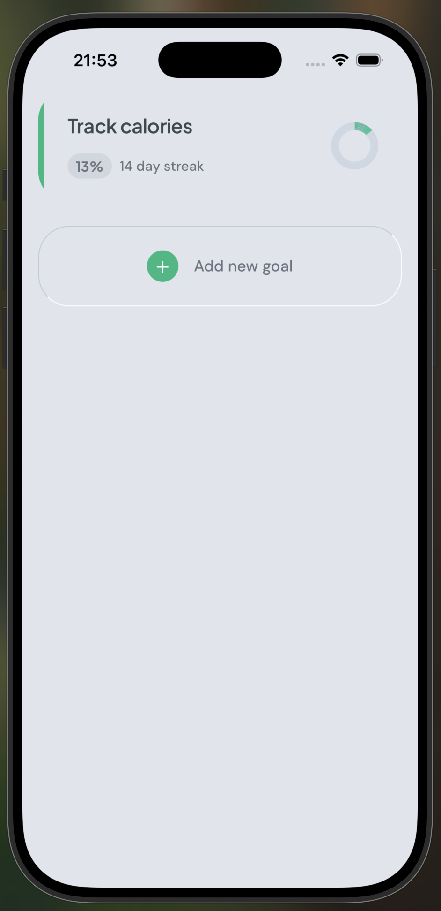
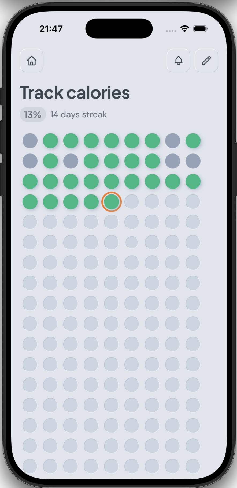

# Dots

A simple, beautiful goal tracker for building daily habits.

> This is a toy app built to explore developing with [Claude Code](https://claude.com/code).

## Screenshots

<p align="center">
  
  
</p>

## What is Dots?

Dots helps you build consistent daily habits through visual tracking. Each day is represented as a dot - complete your goal and the dot turns green.

**Why dots?** Seeing your progress as a grid of colored dots creates a powerful visual chain. You won't want to break it.

## Features

- **Visual Progress** - See your entire goal at a glance with a satisfying grid of dots
- **Quick Complete** - Single tap to mark a day done with a satisfying animation
- **Day Details** - Long-press any dot to add notes or undo completion
- **Stats at a Glance** - See percentage through, days remaining, and current streak
- **Progress Pie** - Home screen shows a pie chart of completed, missed, and remaining days
- **Reminders** - Set daily notifications to stay on track
- **Archive** - Completed goals are archived, or delete them permanently

## How to Use

1. **Create a Goal** - Tap "Add new goal", give it a name and duration
2. **Track Daily** - Open your goal and tap today's dot when done
3. **Stay Consistent** - Watch your chain of green dots grow
4. **Celebrate** - The final day glows gold when you reach the end

## Running the App

Dots is built with React Native and Expo. To run it locally:

```bash
npm install
npx expo start
```

Scan the QR code with [Expo Go](https://expo.dev/client) on your iPhone.
